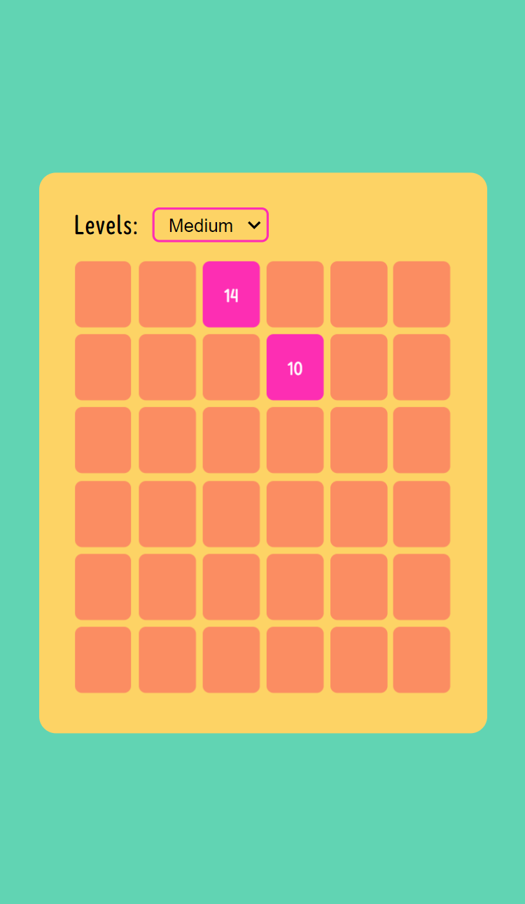
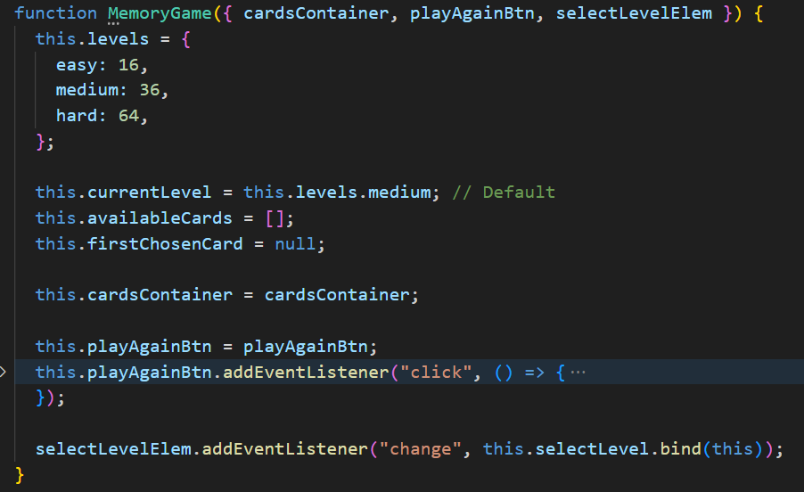
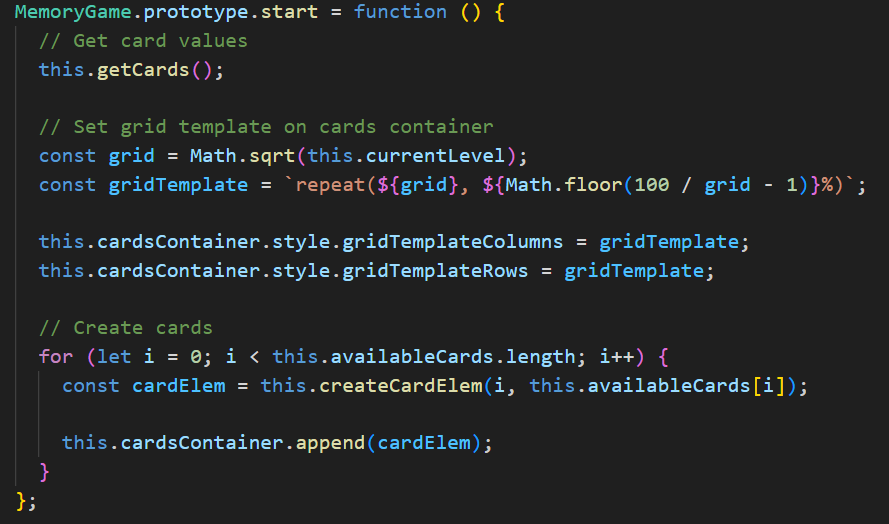
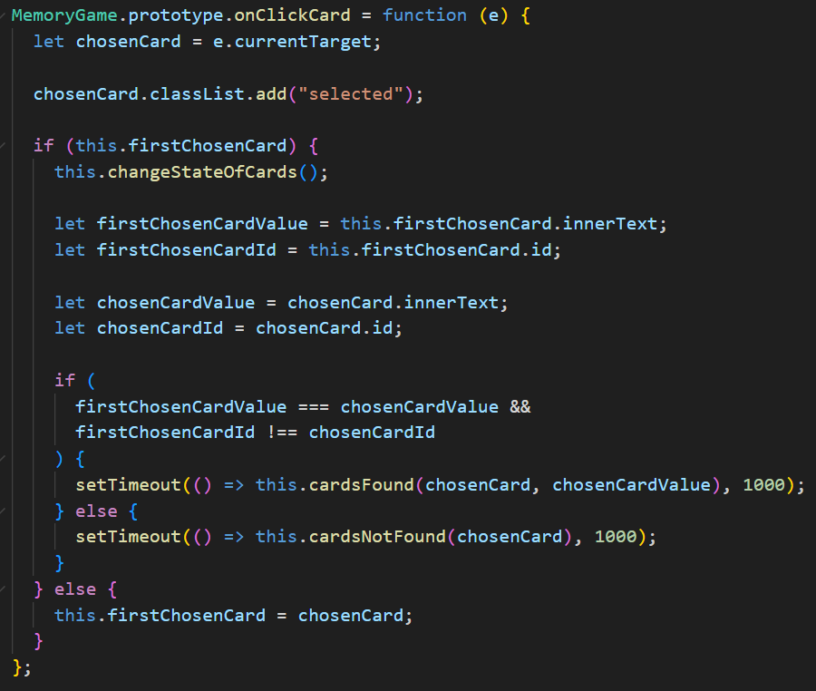
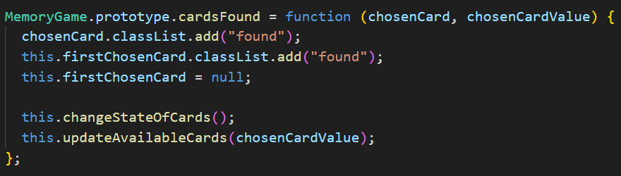
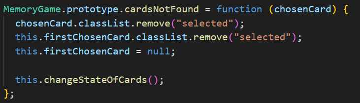

# Memory game

Built with vanilla js.

## How works?

All the game logic is in a constructor function, which expects as parameters the dom elements: cardsContainer, playAgainBtn and selectLevelElem.

_js/app.js_

The start game method is in charge of get the card values and create them, each card has event listeners to hover and click on them.

When the user clicks on a card, it will ask if there is already a chosen card. If it's not, the first chosen card will be the current card clicked. If it's, all the cards will be disabled and it will validated if the first chosen card is equal to the second chosen card, depending on this validation cardsFound or cardsNotFound function will be invoked.

In the cardsFound and cardsNotFound function, all the cards will be allowed to click again and the first chosen card property will be null. In the cardsFound function, the cards found will be removed from the available cards.

If there are no more available cards, the play again button will be visible to the user.

If the user selects another level, the current level property will change and the game will start again.
